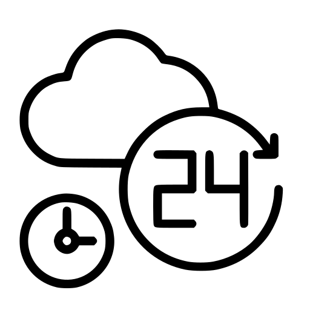

<!--  -->

# Welcome to my coding lair

## I am a software engineer and recently lost in the coding matrix

And here I am exploring and honing my coding skills\
Have a challenge for a Freelancer ? Let's Work Together
  !

---

### I have learned a lot thanks to :smile: [Le Reacteur](https://www.lereacteur.io/) and you can find below all the cool thing. Then I found a bunch of shiny stuff that I will play with it soon

|                         Category                         | Cool Stuff                                                                                                                                                                                                                                                                                                                                                                                                                                                                                                                                                                             |
| :------------------------------------------------------: | -------------------------------------------------------------------------------------------------------------------------------------------------------------------------------------------------------------------------------------------------------------------------------------------------------------------------------------------------------------------------------------------------------------------------------------------------------------------------------------------------------------------------------------------------------------------------------------- |
|     |                                                                                                                                                                                                                                                        |
|  |      |
|                                |                                                                                                                                                                                                                                                                                              |
|                          |                                                                                                                                                                                                                                                                            |

---

### Some statistiques

